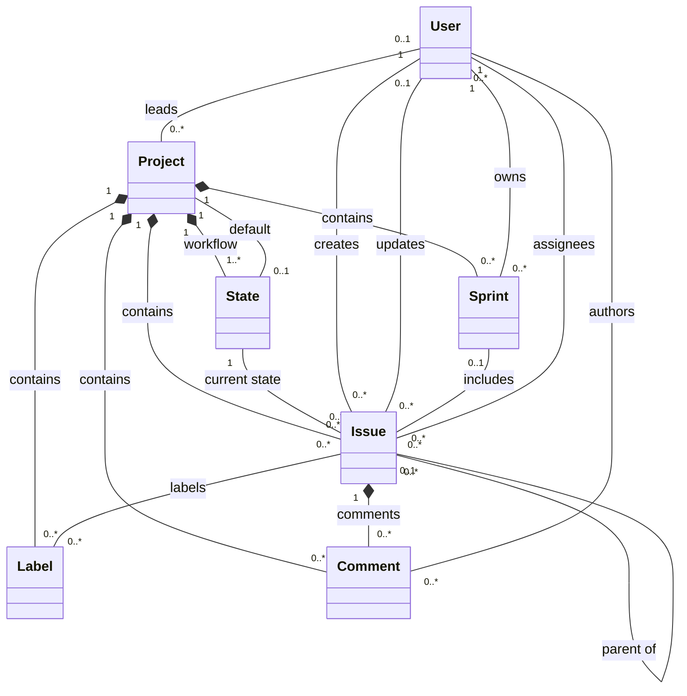

# Plane Light: Basic Kanban/Scrum Backend Design

This document captures a trimmed-down backend/domain design inspired by Plane, focused only on the basics needed for a lightweight task/project management product with Kanban and Scrum flows.

## Goal

Build a small "Plane Light" that supports:

- Projects
- Basic user roles
- Kanban states/columns
- Issues/tasks
- Assignees
- Basic prioritization and due dates
- Scrum sprints (equivalent to Plane's Cycle)
- Adding/removing issues from sprints
- Board/list filtering

Out of scope for the first version:

- Pages
- Modules
- Intake/triage inbox
- Analytics dashboards
- Notifications
- Integrations
- Realtime collaboration
- Rich text editor internals
- Attachments
- Webhooks
- Saved views
- Favorites/recent visits
- Public spaces
- Imports/exports
- Time tracking
- Issue relations/blockers

---

## Core Domain Model

Plane Light is a self-hosted, single-tenant internal tool. Do not carry Plane's workspace multi-tenancy into the MVP domain. The project is the top-level work container.

The minimum Laravel/Eloquent domain is:

```text
Project -> State -> Issue
        -> Sprint
        -> Label
Issue   -> Comment
User    -> issues through assignees / authorship
```

Two relationships need many-to-many pivot tables. In Laravel these are just a migration plus a `belongsToMany` call on each model — no pivot model class is needed unless the pivot gains extra fields.

```text
Table             Columns                    Constraints
issue_assignees   issue_id, user_id          unique(issue_id, user_id), index(user_id)
issue_labels      issue_id, label_id          unique(issue_id, label_id), index(label_id)
```

Rules:
- Pairs must be unique (enforced by composite primary key).
- Do not create a pivot model (`extends Pivot`) until the relationship gains extra fields like `assigned_by_id`, `applied_by_id`, or `applied_at`.

The `belongsToMany` declarations are listed in the relevant model sections below.

Optional but useful later:

```text
Issue -> Sub-issues via parent_id
```

## Eloquent Model Definitions

Use Laravel naming conventions unless there is a strong reason not to:

- Tables use plural `snake_case`: `projects`, `states`, `issues`.
- Columns use `snake_case`: `project_id`, `created_by_id`, `completed_at`.
- Models use singular PascalCase: `Project`, `State`, `Issue`.
- Prefer Laravel enum casts for closed sets such as roles, state groups, priorities, and sprint status.
- Prefer soft/archive timestamps such as `archived_at` over hard deletes for project-level work records.
- Do not add `workspace_id` or workspace-scoped uniqueness in the MVP; this is a single-tenant app.

### Enums

```php
enum Role: string
{
    case Admin = 'admin';
    case Member = 'member';
    case Viewer = 'viewer';
}

enum StateGroup: string
{
    case Backlog = 'backlog';
    case Unstarted = 'unstarted';
    case Started = 'started';
    case Completed = 'completed';
    case Cancelled = 'cancelled';
}

enum IssuePriority: string
{
    case Urgent = 'urgent';
    case High = 'high';
    case Medium = 'medium';
    case Low = 'low';
    case None = 'none';
}

enum SprintStatus: string
{
    case Planned = 'planned';
    case Active = 'active';
    case Completed = 'completed';
}
```

### `users`

Laravel's default `User` model can be reused. In a single-tenant app, user-level role is enough for the MVP.

Important columns:

```text
id
name
email
role Role cast default member
is_active boolean default true
avatar_url nullable
created_at
updated_at
```

Relationships:

```text
hasMany Project as ledProjects via lead_id
belongsToMany Issue as assignedIssues via issue_assignees
hasMany Issue as createdIssues via created_by_id
hasMany Issue as updatedIssues via updated_by_id
hasMany Comment as authoredComments via author_id
```

Rules:

- Admins can manage projects, workflow settings, labels, and users.
- Members can create/update issues and comments.
- Viewers can read only.
- `is_active = false` disables access without deleting historical authorship/assignment references.

### `projects`

Top-level work container.

Important columns:

```text
id
name
identifier // e.g. WEB, API, OPS
nullable description text
nullable lead_id foreignId -> users.id
nullable default_state_id foreignId -> states.id
nullable archived_at timestamp
created_at
updated_at
```

Relationships:

```text
belongsTo User as lead
belongsTo State as defaultState
hasMany State
hasMany Issue
hasMany Sprint
hasMany Label
hasMany Comment
```

Indexes/constraints:

```text
unique(identifier)
unique(name) // optional; identifier uniqueness is the important one
index(archived_at)
```

Rules:

- `identifier` is user-chosen, persisted, globally unique, and normalized to uppercase.
- `identifier + sequence_id` creates stable work item keys like `WEB-1`.
- Creating a project creates default states.

Default states:

```text
Backlog      -> backlog
Todo         -> unstarted
In Progress  -> started
Done         -> completed
Cancelled    -> cancelled
```

### `states`

Kanban column/workflow state.

Important columns:

```text
id
project_id foreignId -> projects.id
name
slug
color
sequence unsignedInteger
group StateGroup cast
is_default boolean default false
created_at
updated_at
```

Relationships:

```text
belongsTo Project
hasMany Issue
```

Indexes/constraints:

```text
unique(project_id, name)
unique(project_id, slug)
index(project_id, sequence)
index(project_id, group)
```

Rules:

- States are ordered by `sequence`.
- One state can be marked default per project.
- Default state cannot be deleted.
- A state cannot be deleted while issues are in it.
- Issue completion is derived from the state group.

### `issues`

Central task/work item.

Important columns:

```text
id
project_id foreignId -> projects.id
state_id foreignId -> states.id
nullable sprint_id foreignId -> sprints.id
nullable parent_id foreignId -> issues.id
sequence_id unsignedInteger
sort_order decimal or unsignedBigInteger
title
nullable description text
priority IssuePriority cast default none
nullable start_date date
nullable due_date date
nullable completed_at timestamp
nullable archived_at timestamp
created_by_id foreignId -> users.id
nullable updated_by_id foreignId -> users.id
created_at
updated_at
```

Relationships:

```text
belongsTo Project
belongsTo State
belongsTo Sprint nullable
belongsTo Issue as parent
hasMany Issue as children via parent_id
belongsTo User as creator via created_by_id
belongsTo User as updater via updated_by_id
belongsToMany User as assignees via issue_assignees
belongsToMany Label via issue_labels
hasMany Comment
```

Indexes/constraints:

```text
unique(project_id, sequence_id)
index(project_id, state_id, sort_order)
index(project_id, sprint_id)
index(project_id, priority)
index(project_id, archived_at)
index(created_by_id)
```

Rules:

- If no state is provided, use the project default state.
- `sequence_id` is unique per project and generates issue keys like `WEB-1`.
- `sort_order` controls board ordering inside a state/column.
- Moving to a `completed` state sets `completed_at`.
- Moving out of a `completed` state clears `completed_at`.
- Assignees must be active users.

### `sprints`

Scrum sprint/timebox. Equivalent to Plane's Cycle concept.

Important columns:

```text
id
project_id foreignId -> projects.id
name
nullable description text
nullable start_date date
nullable end_date date
owner_id foreignId -> users.id // sprint lead; defaults to creator
status SprintStatus cast default planned
nullable archived_at timestamp
created_at
updated_at
```

Relationships:

```text
belongsTo Project
belongsTo User as owner
hasMany Issue
```

Indexes/constraints:

```text
index(project_id, status)
index(project_id, start_date, end_date)
```

Rules:

- Sprint belongs to one project.
- Optional rule: only one active sprint per project.
- Completed sprints should be mostly read-only.
- Sprint can only be deleted by project admins or its owner.

### Sprint assignment

For Plane Light, model sprint membership directly on `issues.sprint_id` instead of using a pivot table.

This keeps the Laravel relationship simple:

```text
Sprint hasMany Issue
Issue belongsTo Sprint nullable
```

Rules:

- An issue can belong to zero or one sprint at a time.
- Issue and sprint must belong to the same project.
- Moving an issue between sprints is a normal issue update: change `sprint_id`.
- Use a pivot table only if the product later needs sprint history, spillover tracking, or many-to-many sprint planning metadata.

### `labels`

Project-scoped reusable tags.

Important columns:

```text
id
project_id foreignId -> projects.id
name
color
created_at
updated_at
```

Relationships:

```text
belongsTo Project
belongsToMany Issue via issue_labels
```

Indexes/constraints:

```text
unique(project_id, name)
```

### `comments`

Important columns:

```text
id
project_id foreignId -> projects.id
issue_id foreignId -> issues.id
author_id foreignId -> users.id
body text
created_at
updated_at
```

Relationships:

```text
belongsTo Project
belongsTo Issue
belongsTo User as author
```

### Minimal Domain UML



---

## Laravel + Inertia Backend Design

Use a conventional Laravel app with Inertia serving the UI. Keep the design close to Laravel defaults to reduce boilerplate:

- **Models**: Eloquent models for first-class domain entities.
- **Controllers**: Resource Controllers for CRUD.
- **Validation/authorization**: Form Requests and Policies.
- **Serialization**: Eloquent API Resources for JSON/Inertia props.
- **UI**: Inertia pages under `resources/js/Pages`.
- **Workflow logic**: small service/action methods only when controller code would become unclear.

### Structure Approach

Do not prescribe a custom folder structure up front. Start from the structure generated by the chosen Laravel + Inertia bootstrap path.

Add application-specific classes only where Laravel conventions make them useful:

- Eloquent models for first-class domain entities.
- Resource Controllers for CRUD-like resources.
- Form Requests when validation/authorization grows beyond simple cases.
- Gates for role-level authorization (e.g. `is-admin`, `is-member`) and Policies for model-scoped authorization (e.g. project access, issue mutations).
- API Resources when response/Inertia prop shaping needs to be explicit.
- Small action/service classes only when a workflow becomes too large for a controller method.

The goal is to lean on generated framework structure, not lock the application into a hand-designed directory layout before implementation.

### Routing Approach

Use `routes/web.php` for Inertia pages and mutations. Prefer `Route::resource` for normal CRUD and add named custom routes only for domain actions.

```text
/projects
  -> ProjectController resource

/projects/{project}/states
  -> StateController resource
  + POST states/reorder
  + POST states/{state}/default

/projects/{project}/issues
  -> IssueController resource
  + POST issues/{issue}/move
  + PUT issues/{issue}/assignees

/projects/{project}/board
  -> invokable BoardController

/projects/{project}/sprints
  -> SprintController resource
  + POST sprints/{sprint}/start
  + POST sprints/{sprint}/complete
  + PUT sprints/{sprint}/issues

/projects/{project}/labels
  -> LabelController resource

/projects/{project}/issues/{issue}/comments
  -> CommentController resource
```

Use scoped route model binding so `State`, `Issue`, `Sprint`, `Label`, and `Comment` are always resolved inside the current project context.

### Controller Responsibilities

| Controller | Role |
| --- | --- |
| `ProjectController` | Project CRUD; create default states on project creation. |
| `StateController` | Workflow column CRUD, default state, and state ordering. |
| `IssueController` | Issue CRUD, filters, assignment sync, and issue movement. |
| `BoardController` | Read-only board page/read model grouped by state. |
| `SprintController` | Sprint CRUD, start/complete lifecycle, and issue membership sync. |
| `LabelController` | Project-scoped label CRUD. |
| `CommentController` | Issue comment CRUD. |

Mutation controllers should usually validate through Form Requests, authorize through Policies, perform the write, and redirect back with flash data for Inertia.

### Eloquent API Resources

Use API Resources as the serialization boundary for both JSON responses and Inertia props.

Recommended resources:

```text
UserResource
ProjectResource
StateResource
IssueResource
BoardResource
SprintResource
LabelResource
CommentResource
```

Guidelines:

- Use `Resource::collection(...)` for lists.
- Use `whenLoaded()` for relationships like `assignees`, `labels`, `states`, and `issues`.
- Use `whenCounted()` for counts like comments, issue totals, or sprint progress.
- Compute presentation fields like issue key (`WEB-123`) in `IssueResource`.
- Do not put authorization, validation, or mutation logic in resources.

---

## Core Business Logic to Preserve from Plane

### 1. Project scoping everywhere

The Eloquent model definitions make `project_id` the main work boundary. Preserve that boundary in every query, policy, route binding, and mutation so states, issues, sprints, labels, and comments cannot leak across projects.

### 2. Project-local issue keys

Plane's `projects.identifier + issues.sequence_id` pattern is worth keeping.

```text
WEB-1
WEB-2
WEB-3
```

This is much more user-friendly than exposing UUIDs.

### 3. State groups, not just columns

Separate custom workflow names from semantic meaning.

Example:

```text
Backlog      group backlog
Todo         group unstarted
Doing        group started
Code Review  group started
Done         group completed
Won't Do     group cancelled
```

This lets users customize workflows without breaking completion/progress logic.

### 4. Completion derived from state group

Do not store independent `isDone` unless necessary.

```text
if issue.state.group == completed:
  completed_at = now
else:
  completed_at = null
```

### 5. Sparse sort ordering

Use sparse numbers for drag/drop ordering.

Initial examples:

```text
10000
20000
30000
```

Insert between two cards:

```text
new_sort_order = (before.sort_order + after.sort_order) / 2
```

Periodically normalize if numbers get too dense.

### 6. Safe workflow mutations

Rules:

```text
Cannot delete default state
Cannot delete state with issues
Cannot delete project without admin rights
Cannot assign inactive user to issue
Cannot add issue to sprint from another project
```

### 7. Keep filters simple

Initial filters:

```text
state_id
assignee_id
priority
sprint_id
search
created_by_id
due_date
```

Avoid saved views/advanced filter DSL until the basic product is solid.

---

## Minimal Route Surface

The concrete route shape should follow the Laravel routing approach above rather than maintaining a second exhaustive API map. The minimum route surface is:

```text
Auth/session routes from the chosen Laravel starter kit
Project resource routes
Nested state resource routes plus default/reorder actions
Nested issue resource routes plus move/assignee-sync actions
Project board route
Nested sprint resource routes plus start/complete actions
Label resource routes
Nested comment resource routes
```

---

## Minimal UI Views

If translating this into frontend/product screens:

### Home

```text
Project list
User/account menu
```

### Project

```text
Project settings
Label settings
```

### Kanban

```text
Project board
Backlog/list
Issue detail drawer/page
```

### Scrum

```text
Sprint list
Sprint planning/backlog
Sprint board
Sprint summary
```

### Settings

```text
Workflow/state settings
Labels
```

---

## Suggested Build Order

### Phase 1: Kanban core

Domain models:

```text
User
Project
State
Issue
Label
Comment
```

Relationship tables:

```text
issue_assignees
issue_labels
```

Features:

```text
Create project
Create default states
Create issue
Move issue across board
Assign issue
Label issue
Comment on issue
Filter board
```

### Phase 2: Scrum

Domain models:

```text
Sprint
```

Features:

```text
Create sprint
Assign issues to sprint
Sprint board
Start/complete sprint
Basic progress count
```

### Phase 3: Collaboration polish

Models/features:

```text
Activity log
```

### Phase 4: Product niceties

Models/features:

```text
Saved views
Notifications
Attachments
Subtasks
Issue relations
```

---

## Summary

The essence of Plane for basic Kanban/Scrum is:

```text
Project
State
Issue
Label
Comment
Sprint
```

With these persistence-only relationship tables:

```text
issue_assignees
issue_labels
```

The most valuable Plane ideas to replicate are:

1. Project scoping
2. Custom states grouped by semantic state groups
3. Project-local issue sequence IDs
4. Sparse sort ordering for drag/drop
5. Sprints (equivalent to Plane's Cycles)
6. Issue completion derived from state group
7. Simple role-based permissions

This gives a small, coherent backend domain while preserving the parts of Plane that make basic task/project workflows work.
